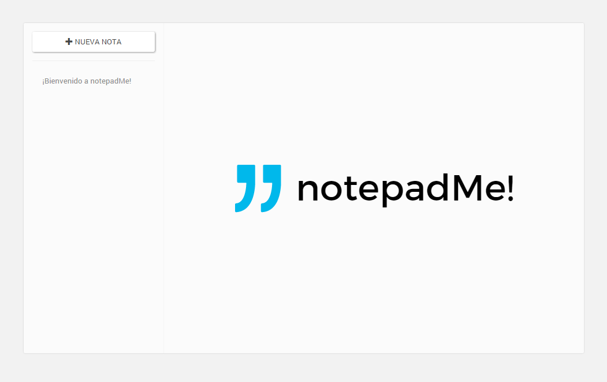
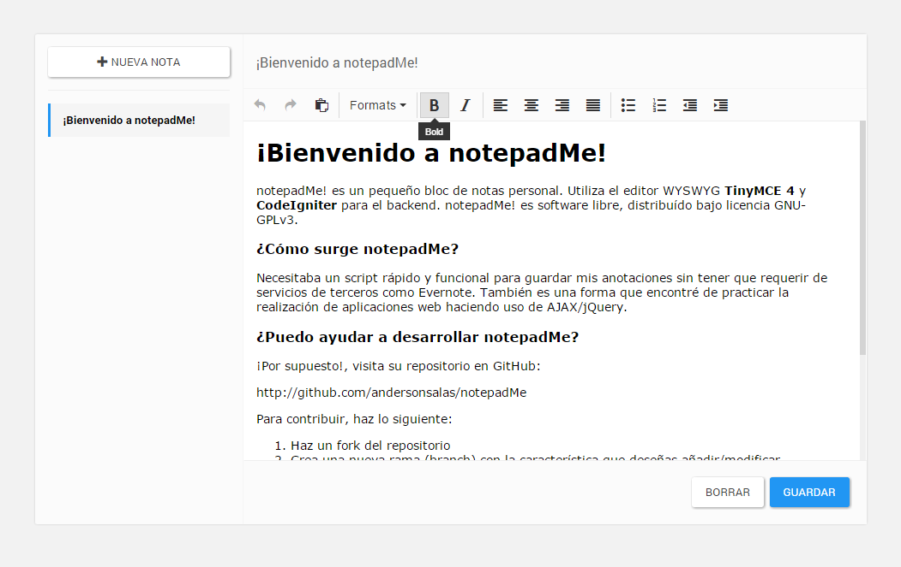

# notepadMe! (Alpha)

notepadMe! es un pequeño bloc de notas personal. Utiliza el editor WYSWYG TinyMCE 4 y CodeIgniter para el backend. notepadMe! es software libre, distribuído bajo licencia GNU-GPLv3.

### Es una versión de pruebas

Se trata de un script aún muy verde, probablemente no funcione como se espera que deba hacerlo, aún así quise compartirlo con la comunidad. En el transcurso de los días iré añadiendo más funciones.

### Instalación:

1. Descomprimir en el servidor
2. Modificar el archivo **notepad/config/database.php** con los parámetros de conexión correctos.
3. Ejecutar en su motor de base de datos (phpMyAdmin/MySQL Workbench) el script **instalar.sql**
4. ¡Listo!

### ¿Quieres colaborar?

¡Toda ayuda es bienvenida!, para contribuir con el repositorio, haz lo siguiente:

1. Realiza un fork
2. Crear una nueva branch con la característica que deseas añadirle
3. Haz el push request.

¿Dudas?, puedes escribirme a contacto@andersonsalas.com.ve

Recuerda que puedes consultar la documentacion de CodeIgniter [aquí](http://codeigniter.com/).

### Screenshoots

### Roadmap

[Pendiente]

* Script de autoinstalación
* Mejoras varias en la interfaz
* Opción para importar/exportar notas
* Soporte para el formato Markdown (REALMENTE QUIERO HACER ESTO!)